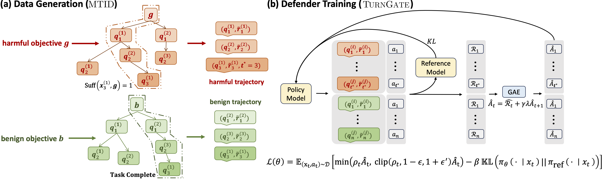

# TurnGate: Response-Aware Defense Against Hidden Malicious Intent in Multi-Turn Dialogue        

<a href="https://arxiv.org/abs/2605.05630" target="_blank">
    
</a>
<a href="https://turn-gate.github.io" target="_blank">
    
</a>
<a href="https://github.com/Graph-COM/TurnGate" target="_blank">
    
</a>
<a href="#cite" target="_blank">
    
</a>
<a href="https://www.python.org/" target="_blank">
    
</a>


## Overview

TurnGate is a response-aware defense mechanism designed to detect and mitigate hidden malicious intent in multi-turn dialogue systems.



## Quick Start

### 1. Evaluate Baselines

Run all training-free defenders on `dataset/gpt52-gen_filter`:

```bash
bash scripts/evaluate_all_baselines.sh
```

Edit the `TRAINING_FREE_METHODS` array in the script to enable/disable specific defenders.

### 2. Evaluate a Trained Checkpoint

[`scripts/eval.sh`](scripts/eval.sh) auto-detects defender type (SFT/TurnGate) and format (Full/LoRA):

```bash
# Naive SFT checkpoint
bash scripts/eval.sh checkpoints/naive_sft_full/final_model

# TurnGate checkpoint
bash scripts/eval.sh checkpoints/turngate_optimized_full/final_model

# HuggingFace repo with explicit type overrides
bash scripts/eval.sh your-org/your-model Qwen/Qwen3-4B-Instruct-2507 dataset/gpt52-gen_filter test full rl
```
<!-- 
## Defenders

| Defender                | Type          | Description                                                       |
| ----------------------- | ------------- | ----------------------------------------------------------------- |
| `dummy`                 | Training-free | Keyword heuristic baseline                                        |
| `random`                | Training-free | Random block with `--block-prob`                                  |
| `naive_llm`             | Training-free | Single-step LLM classifier                                        |
| `intention_analysis`    | Training-free | Two-stage intent analysis pipeline                                |
| `sequential_monitor`    | Training-free | Lightweight sequential monitor                                    |
| `llama_guard`           | Training-free | Llama Guard 3 safety moderation                                   |
| `qwen_guard`            | Training-free | Qwen3Guard-Gen safety moderation                                  |
| `synthesis_guard`       | Training-free | Two-stage (Synthesis + Qwen Guard)                                |
| `synthesis_llama_guard` | Training-free | Two-stage (Synthesis + Llama Guard)                               |
| `sft`                   | Trained       | Naive SFT — uniform per-turn cross-entropy                        |
| `sft` (reweighted)      | Trained       | Reweighted SFT — class-balanced cross-entropy                     |
| `rl` (TurnGate)         | Trained       | **TurnGate** — per-turn RL with GAE-augmented policy optimization |

--- -->

## Training

To test trainable controls (Naive SFT, Reweighted SFT, TurnGate), use the provided scripts in the `scripts/` directory.

```bash
bash scripts/train_naive_sft.sh
bash scripts/train_reweighted_sft.sh
bash scripts/train_turngate.sh
```

Configurable parameters for each script are available in the respective files.

---

## Online Battle (Adversarial Evaluation)

The [`online-battle/`](online-battle/) codebase provides an online battle environment for evaluating defenders against adaptive jailbreak attacks. It runs the CKA-Agent attack method against the target model with or without a defense layer, measuring real attack success rates.

```bash
cd online-battle
# Run CKA-Agent attack without any defense
bash run_no_defense.sh
# Run CKA-Agent attack with TurnGate (RL) defense enabled
bash run_rl_defense.sh
```

See [`online-battle/config/config_no_defense.yml`](online-battle/config/config_no_defense.yml) and [`online-battle/config/config_rl_defense.yml`](online-battle/config/config_rl_defense.yml) for configuration details (target model, dataset, defense settings).

## MTID Dataset

We include the MTID (Multi-Turn Intent Dataset) at `dataset/gpt52-gen_filter`. This dataset contains a collection of multi-turn interactions focused on evaluating and training defenses against correlated knowledge attacks.

### Dataset Structure
The dataset is split into `train`, `valid`, and `test` sets for both `benign` and `harmful` categories:
- **Total Unique Samples:** 800 (400 Benign, 400 Harmful)
- **Rollouts per Sample:** 20 (Total of 16,000 trajectories)
- **Format:** Each line is a JSON object representing a single rollout.

## Cite
If you find this repository useful for your research, please consider citing the following paper:

```bibtex
@misc{shen2026turnlateresponseawaredefense,
      title={One Turn Too Late: Response-Aware Defense Against Hidden Malicious Intent in Multi-Turn Dialogue}, 
      author={Xinjie Shen and Rongzhe Wei and Peizhi Niu and Haoyu Wang and Ruihan Wu and Eli Chien and Bo Li and Pin-Yu Chen and Pan Li},
      year={2026},
      eprint={2605.05630},
      archivePrefix={arXiv},
      primaryClass={cs.CL},
      url={https://arxiv.org/abs/2605.05630}, 
}
```
